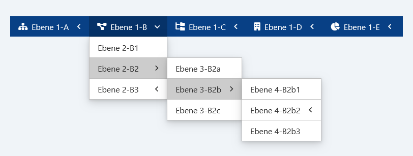
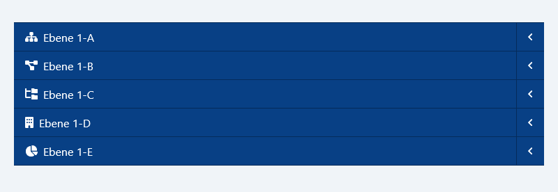
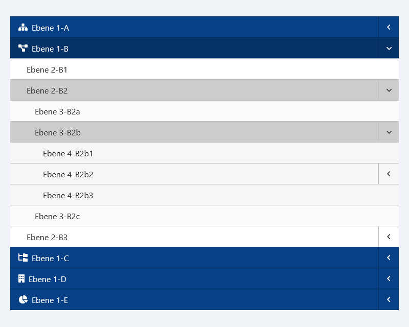

# `menu.js`


Das Widget implementiert ein flexibles Navigationsmenü, das automatisch zwischen vertikalem und horizontalem Layout wechselt. Es bietet umfangreiche Funktionen für das Handling von verschachtelten Menüstrukturen und interaktiven Elementen.

## Funktionalitäten

- Automatischer Wechsel zwischen vertikalem und horizontalem Layout basierend auf einem konfigurierbaren Breakpoint
- Unterstützung für verschachtelte Menüs mit Animation beim Ein- und Ausblenden
- Optionaler Maus-Hover-Modus für die horizontale Darstellung
- Automatische Schließung offener Untermenüs beim Klick außerhalb des Menüs
- Anpassbare CSS-Klassen für alle Menükomponenten

## Voraussetzungen

- jQuery `1.7` oder höher
- jQuery UI `1.8` oder höher (mindestens: Core => Widget)
- Moderne Browser mit CSS3-Unterstützung

## Methoden

| **Methode**   | **Beschreibung**                                     | **(Typ) Parameter** | **Standardwert** |
| ------------- | ---------------------------------------------------- | ------------------- | ---------------- |
| **`destroy`** | Zerstört das Widget und setzt alle Änderungen zurück | -                   | -                |

## Optionen

| **Option**       | **Beschreibung**                                                      | **Typ**   | **Standardwert** |
| ---------------- | --------------------------------------------------------------------- | --------- | ---------------- |
| **`mouseHover`** | Aktiviert/Deaktiviert die Hover-Funktionalität im horizontalen Layout | `Boolean` | `false`          |
| **`breakpoint`** | Pixel-Wert für den Wechsel zwischen den Layouts                       | `Number`  | `1200`           |
| **`duration`**   | Animationsdauer in Millisekunden                                      | `Number`  | `200`            |
| **`easing`**     | Easing-Funktion für Animationen                                       | `String`  | `"linear"`       |
| **`classes`**    | CSS-Klassen für verschiedene Menü-Elemente                            | `Object`  | Siehe unten      |

### CSS-Klassen-Konfiguration (`classes`)

| **Option**           | **Beschreibung**               | **Typ**  | **Standardwert**    |
| -------------------- | ------------------------------ | -------- | ------------------- |
| **`menu`**           | Basis-Klasse für das Menü      | `String` | `"menu"`            |
| **`menuHorizontal`** | Klasse für horizontales Layout | `String` | `"menu-horizontal"` |
| **`menuVertical`**   | Klasse für vertikales Layout   | `String` | `"menu-vertical"`   |
| **`menuList`**       | Klasse für Menülisten          | `String` | `"menu-list"`       |
| **`menuItem`**       | Klasse für Menüelemente        | `String` | `"menu-item"`       |
| **`menuLink`**       | Klasse für Menülinks           | `String` | `"menu-link"`       |
| **`menuText`**       | Klasse für Menütexte           | `String` | `"menu-text"`       |
| **`menuIcon`**       | Klasse für Menüicons           | `String` | `"menu-icon"`       |
| **`active`**         | Klasse für aktive Elemente     | `String` | `"active"`          |

## Installation

```sh
git clone https://github.com/K3nguruh/menu.git
```

## Anwendung

### JavaScript-Einbindung

```html
<script src="assets/libs/jquery.min.js"></script>
<script src="assets/libs/jquery-ui.min.js"></script>

<script src="assets/menu.min.js"></script>
```

### Stylesheet-Einbindung

```html
<link href="assets/menu.min.css" rel="stylesheet" />
```

### HTML-Grundstruktur

```html
<!-- Automatische Initialisierung durch das data-plugin="menu" Attribut -->
<nav id="menu" data-plugin="menu">
  <ul>
    <li><a href="#">Startseite</a></li>
    <li>
      <a href="#">Produkte</a>
      <ul>
        <li><a href="#">Kategorie 1</a></li>
        <li><a href="#">Kategorie 2</a></li>
      </ul>
    </li>
    <li><a href="#">Über uns</a></li>
    <li><a href="#">Kontakt</a></li>
  </ul>
</nav>
```

### JavaScript-Initialisierung

```javascript
/* Manuelle Initialisierung mit Standard Optionen */
$(function () {
  $("#menu").menu();
});
```

```javascript
/* Manuelle Initialisierung mit geänderten Optionen */
$(function () {
  $("#menu").menu({
    mouseHover: true,
    breakpoint: 992,
    duration: 300,
    classes: {
      menuHorizontal: "custom-horizontal",
      menuVertical: "custom-vertical",
      menuItem: "custom-item",
      active: "custom-active",
    },
  });
});
```

## Beispiele


<br>_Horizontale Ansicht_


<br>_Horizontale Ansicht mit geöffnetem Untermenü_


<br>_Vertikale Ansicht_


<br>_Vertikale Ansicht mit geöffnetem Untermenü_

## Support

Bei Fragen oder Problemen:

- Erstelle ein [GitHub Issue](https://github.com/K3nguruh/menu/issues)
- Kontaktiere den Maintainer über GitHub

## Lizenz

Dieses Projekt ist unter der MIT-Lizenz lizenziert. Siehe [LICENSE](LICENSE.md) für Details.
